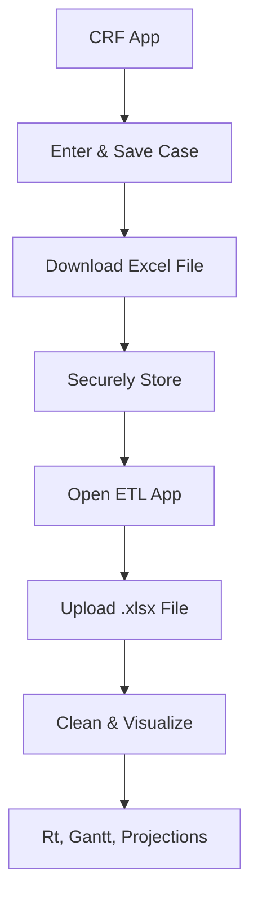

# 📘 Measles Case Reporting & Outbreak Analytics Toolkit

**Author:** Devi Dwarabandam
--- 
**Tools:** R Shiny App | Excel | Measles CRF | ETL & Modeling | Scenario Projections Dashboard  
**Last Updated:** April 2025 
--- 
- **CRF Repo URL:** https://github.com/ddwarabandam/NEMeasleswebCRFalpha 
- **ETL App Repo URL:** https://github.com/ddwarabandam/NEMeasleswebETLalpha
- **Random Data Generator Script Repo:** https://github.com/ddwarabandam/NEMeasleswebETLalpha.git
- **Live CRF App** : https://dattatechddwarabandam.shinyapps.io/NEMeasleswebCRFalpha/  
- **Live ETL App** : https://dattatechddwarabandam.shinyapps.io/NEMeasleswebETLalpha/


---

## 🔍 Overview

This public health-ready toolkit is designed to help field epidemiologists, contact tracers, and health department staff with:

- ✅ **Case investigation & contact tracing (via CRF app)**
- 📈 **Descriptive epidemiology and trend analysis (via ETL app)**
- 🧮 **Modeling outbreak growth (Rt) and scenario forecasting**
- 🔐 **Ensuring privacy & confidentiality via local-only, session-based data flow**

Specifically 
- Collecting standardized measles case investigation data
- Ensuring local and secure data handling
- Analyzing epidemic trends, vaccination status, Rt estimation, and outbreak projections
- Facilitating visual reporting via downloadable epidemic curves, Gantt charts, and dynamic scenario models

---

## 📦 App Components

### 1. Case Report Form (CRF) App

Used for **data collection** during interviews with suspected/confirmed measles cases.

- 🔹 Clean, tab-based interface (Case Info → Final Status) namely basic case, demographic, clinical, exposure, vaccination, lab, and final status information
- 🔹 Required fields use placeholder hints to guide entry (no strict required fields)
- 🔹 `yyyy-mm-dd` enforced for all date fields
- 🔹 Download your case as `.xlsx` file
- 🔹 **No server-side storage**
- 🔹 **Data auto-deletes on refresh, timeout, or tab closure**

**❗ Session Security**:  
All data is held **in memory only** and **purged** immediately on:
- Browser refresh
- Tab close
- Inactivity timeout (~15 mins)

**✅ Safe Save Behavior**:  
All `input$` fields are passed through a helper function:
```r
safe_value <- function(x) if (length(x) == 0 || is.null(x)) NA else x
```

This prevents app crashes during save even if fields are left blank.

---

## 📥 CRF App Instructions

1. Visit the hosted CRF app: https://dattatechddwarabandam.shinyapps.io/NEMeasleswebCRFalpha/
2. Navigate through tabs:  
   - **Case Info**, **Demographics**, **Clinical**, **Exposure/Contact**, **Vaccination**, **Healthcare & Labs**, **Final Status**
3. Enter data in all fields as per instructions. White space was intentional to allow other apps to open side by side this web app.
4. **Use date pickers** for date fields (`yyyy-mm-dd`).
5. Once complete, click **Save Case**.
6. Click **Download Excel** to save the file on your device.
7. **Important**: Data will be erased if you leave, refresh, or timeout (~15 mins).

---
## 🔁 Appending Multiple Cases

Each CRF case is saved as a separate Excel file. To combine cases:
1. Open all individual `.xlsx` files.
2. Copy-paste rows into a **master workbook**.
3. Save the final combined file with a name like `measles_cases_combined.xlsx`.

---
## ✅ 📦 R Script to Auto-Append Multiple Excel Files
### 🧰 How to Use It
- Go to github repo: https://github.com/ddwarabandam/NEMeasleswebETLalpha.git
- Find the R script: R_Script_Auto_Append.R
- Copy and paste in RStudio or R console
- Insert your file path in 
```r
# 📁 Set folder path where individual CRF files are stored
folder_path <- "insert filepath"
```
- 📌 Save this R script as combine_cases.R

- Make sure all your .xlsx case files are stored in the same folder.

- Run the script in RStudio or R console

- You’ll get a new file:
- measles_cases_combined.xlsx in the same folder

## ✅ Optional: Power Query in Excel (No R Needed)
If you'd rather stay inside Excel:

- Open Excel > Data tab > Get Data > From File > From Folder

- Browse to the folder with .xlsx case files

- Select all → Combine & Transform

- Excel will append all rows into a single sheet automatically

- Click Close & Load to save into a workbook


## 2. ETL & Modeling App

Used for **uploading and analyzing CRF data files** (.xlsx).

Key Features:
- 📄 Upload cleaned `.xlsx` file from CRF
- 📋 Review clean data table
- 📊 Frequency tables (age group, vaccination status, etc.)
- 🧭 Gantt chart: visualizes contagious periods per case
- 📈 Interactive, stratified epi curves by:
  - Age Group
  - Vaccination Status
  - Sex at Birth
  - Race/Ethnicity
  - Geography (City, County, State)
  - Working Case Status & Final Case Status
- 🧠 Rt estimation using `EpiEstim`
- 📉 14-day projection using fixed or dynamic Rt values
- 🧩 Scenario modeling: compare multiple Rt scenarios

---

## 📊 ETL App Instructions

1. Visit the ETL app: https://dattatechddwarabandam.shinyapps.io/NEMeasleswebETLalpha/
2. Upload the Excel file(s) downloaded from CRF app
3. Review cleaned data table
4. Scroll to:
   - **Summary Frequency Tables**
   - **Vaccination vs Age Cross-tab**
   - **Interactive Epidemic Curves**
   - **Gantt Charts of Contagious Period**
   - **Rt Estimation Over Time**
   - **14-Day Forecast (Fixed Rt = 1.2)**
   - **Scenario Modeling (Rt = 1.2, 1.4, 1.6)**
   - **Custom Scenario Inputs**

---

## 🔁 Case Re-Entry or Follow-up Workflow

If a case needs follow-up data entry (e.g., now confirmed or hospitalized), the same case ID **can be reused**:

🟡 Open the CRF app  
🟡 Re-enter the **same Case ID**  
🟡 Fill in updated or new information  
🟡 **Leave previously entered fields blank**  
🟡 Download this updated `.xlsx` row

> The ETL app will simply append the updated row. Review teams can later merge/edit in Excel using filters or `case_id` match.

---

## ❌ In-App Table Edits Not Allowed

To **ensure data integrity**, the ETL Viewer does **not support editing** directly in the table. Only designated data managers with secure access to the Excel master file are permitted to:

- Manually review/clean using Excel filters
- Apply validation rules and formulas
- Correct entries using `case_id` row tracking

---
# Epidemic Modeling Details
📉 Rt Estimation Over Time
- The Rt Estimation module in the ETL app calculates the effective reproduction number (Rt) over time based on observed incidence data (i.e., cases by symptom_onset_date). This helps track how the measles outbreak is evolving and evaluate the effect of interventions.

### 🧠 What is Rt?
- Rt: Average number of secondary cases generated by a single infected individual at time t.

- When Rt > 1 → the outbreak is growing

- When Rt = 1 → stable transmission

- When Rt < 1 → outbreak is shrinking

🔬 How It's Calculated
- The app uses the EpiEstim package to estimate Rt using a parametric serial interval (SI) approach.

```r

estimate_R(
  incid = I,
  method = "parametric_si",
  config = make_config(list(
    mean_si = 12,
    std_si = 3,
    t_start = ...,  # sliding window
    t_end = ...
  ))
)
```
## 📐 Serial Interval (SI) Settings for Measles

Parameter	Value	Why?

Parameter | Value | Why?
--- | --- | ---
Mean SI | 12 | Based on CDC & literature (Fine et al., Wallinga & Teunis)
SD SI | 3 | Reflects natural variability in transmission intervals

## Gamma distribution is used because:

- Serial interval values are positive

- Measles SI is typically right-skewed

- Gamma captures variability and fits observed data well

## 📊 Rt Plot Interpretation

The Estimated Rt plot shows:

- A red line for the mean Rt over time

- A shaded band for the 95% credible interval (CI)

- A horizontal dashed line at Rt = 1, the epidemic control threshold

Section | Description
--- | ---
Red Line | Mean Rt estimate
Shaded Band | 95% credible interval of Rt
Rt = 1 Dashed Line | Threshold for containment


## 🛠 Methodology Notes

- Rt is estimated over a sliding window of 7–14 days (by default).

- Requires at least 8 daily incidence points for reliable estimation.

- Automatically maps symptom_onset_date to daily incidence counts.

## ⚠️ Troubleshooting
If you see a message like:

```kotlin
Not enough data for Rt estimation.
```
It means fewer than 8 days of incidence were available. Try loading a bigger dataset.


## 🧪 Use Cases

🧭 Monitor outbreak control status

📆 Compare Rt before and after interventions

🧬 Feed into scenario modeling and forecasts


## ⚠️ Warning: “You’re estimating R too early in the epidemic...”
When using the Rt estimation module, you might see a warning like:

```vbnet
You're estimating R too early in the epidemic to get the desired posterior CV.
```
## 🔍 What Does This Mean?
This warning comes from the EpiEstim package and indicates that:

- The estimation window (e.g., first 7–10 days) has too few cases, or

- There is insufficient variability in the incidence data

- As a result, the posterior distribution of Rt is too uncertain (high coefficient of variation or CV)

## 🧠 What is Posterior CV?
- Posterior CV is a measure of uncertainty in the estimated Rt.

- A high CV (> 0.3) means your Rt estimate is unstable, possibly due to sparse or early data.

## 🛠️ When Does It Happen?
- Very early in the outbreak (low incidence)

- Flat or zero case counts over consecutive days

- Very short time series (less than ~8–10 observations)

## ✅ How to Fix or Interpret It

Action | Description
--- | ---
✅ Add more data | Upload data covering more days (≥14 ideally)
⏳ Wait before estimating Rt | Delay estimation until there’s a clear signal of sustained transmission
ℹ️ Accept early estimates with caution | Rt might still be calculated but with wider confidence intervals
🧪 Use projections instead | If Rt fails early, scenario modeling can still guide planning

## 📌 In Your App
Even with the warning, Rt may still be plotted — just understand that:

- The initial values may not be reliable

- The confidence bands will be wide

- Rt will stabilize as more data comes in

## 🧠 Developer Tip
If you're building automated workflows:

```r
# Check for high Rt values
res <- estimate_R(...)
if (any(res$R$`Mean(R)` > 10)) {
  warning("Very high Rt - likely unstable early estimate.")
}
```

## 🛠️ Troubleshooting: Rt Estimation Not Covering Full Date Range

### 🧩 Problem
Your dataset includes cases from October 2024 through April 2025, but the Rt estimation only plots up to January 2025.

Meanwhile, the console shows this warning:

```vbnet

Warning in estimate_R_func(incid = incid, method = method, si_sample = si_sample, :
You're estimating R too early in the epidemic to get the desired posterior CV.
```
## 📌 Why This Happens
Even though you have data through April, the Rt estimation window slides across time and uses:

- A start time t_start

- An end time t_end to compute Rt over a moving window (commonly 7 days).

If later days of your incidence data include:

- Very few or zero cases, or

- Flat or sparse counts (e.g., 1 case every 5–6 days),

then EpiEstim:

- Skips those windows

- Or stops estimating Rt altogether

- Because it cannot achieve the required posterior certainty (low CV)

# 🧠 What is CV?
CV (Coefficient of Variation) measures how uncertain Rt is in each window.

If posterior CV > 0.3, EpiEstim considers the estimate unreliable and suppresses output.


## ✅ How to Fix / Improve It

Solution | Description
--- | ---
📈 Add more data points | Include additional days or small cases beyond April if available
🧪 Increase Rt window size | Adjust t_start and t_end to widen estimation windows (e.g., use 10–14 day windows)
🛠 Set min_cases cutoff | Filter out dates with <2 cases before Rt estimation
🧘 Accept short-term Rt only | Treat this as a sign that Rt became unstable due to case drop-off


## 🧪 Developer Note
In your app, t_start and t_end are calculated like this:

```r
# Rt estimation
I <- df_rt$incidence
t_start <- seq(2, length(I) - 7)
t_end   <- t_start + 7
```
As length(I) shortens (due to zeros at end), Rt cannot be estimated beyond a point.

## 📝 Recommendation
For example, if Rt stops at Jan 2025 even though data exists until April 2025 — it's a valid outcome suggesting:

✅ Possible outbreak control
⚠️ Or data sparsity limiting confidence

Document this in your summary reports so others understand why Rt ends earlier than the data.


---

## 🧠 Why Gamma Distribution for Serial Interval?

| Concept | Explanation |
|--------|-------------|
| Serial Interval (SI) | Time between symptom onset in a primary vs secondary case |
| Gamma Distribution   | Positively-skewed and non-negative — perfect for SI |

### Why Gamma?
- Realistic outbreak modeling (e.g., CDC, Wallinga et al.)
- Mean SI ≈ 12 days; SD ≈ 3 days for measles 
- Allows flexibility in Rt and projection estimation

---

# 📈 Scenario Modeling with Custom Rt Values
The Scenario Modeling section of the Measles ETL app allows public health staff to simulate future outbreaks based on assumed transmission rates. This helps in planning response strategies, estimating case loads, and evaluating potential impact of interventions.

## 🔍 What is Rt?
### Rt (effective reproduction number) tells you:

On average, how many people a single infected person will infect at time t (in current outbreak conditions).

- Rt > 1 → outbreak is growing

- Rt = 1 → stable

- Rt < 1 → shrinking

## 🧪 Scenario Modeling Types

## ✅ 1. Fixed Rt Scenarios
Choose from pre-defined Rt values like:

- Rt = 1.3

- Rt = 1.5

- Rt = 1.6

These are displayed as separate facets to visualize how projections change based on increasing transmissibility.

## ✨ 2. Custom Rt Scenarios

You can add your own Rt values and give them meaningful labels (e.g., "School Reopening", "Post-PEP").

### 💡 Steps to Add Custom Rt Scenarios:

1. Open the app and scroll to the "Custom Rt Scenario Modeling" section.

2. Enter an Rt value (e.g., 1.35).

3. Give it a label (e.g., "Spring Break Travel").

4. Click Add Scenario.

You'll see the scenario show up in a faceted plot, allowing you to compare it to other inputs.

## 🔎 How to Find/Choose Rt Values for Specific Scenarios

|Scenario | Example Rt | Notes
--- | --- | ---
High vaccination coverage + masking | 0.8–1.0 | Likely outbreak decline
Baseline measles in susceptible school | 1.2–1.4 | Mild spread
Household cluster | 1.5–1.7 | High risk if unvaccinated
Superspreader event (e.g., flight, mass gathering) | 2.0–3.5 | Based on literature, past MMR gaps
Post-PEP scenario | <1.0 | If PEP is timely and effective


### 📘 Note: Use published estimates, local context (e.g., vaccination gaps), and case investigation data to estimate realistic Rt values. Measles has R₀ = 12–18 in naïve populations.


## 📉 What the Charts Show
Each scenario displays:

- Median predicted incidence (blue solid line)

- 95% Credible Interval (shaded)

- projected over 14 days

These projections help visualize worst-case, expected, and best-case spread under each scenario.

## 📦 Export and Use
You can:

- Download, pan, zoom, drag or do several other actions on the plot as per Plotly interactive commands permit

- Use download png or jpeg plots with labels in briefings or meetings

- Simulate "what-if" interventions (e.g., Rt drops due to vaccination or masking)


## ⚙ Packages Used

| Package | Use |
|--------|-----|
| `shiny` | App framework |
| `readxl`, `openxlsx` | Excel file input/output |
| `lubridate` | Date handling |
| `dplyr`, `tidyr` | Data cleaning |
| `ggplot2`, `plotly` | Interactive plotting |
| `EpiEstim` | Rt estimation |
| `projections` | Future incidence simulation |
| `incidence` / `incidence2` | Epidemic curve structure |
| `distcrete` | Discretized serial intervals |
| `DT` | Data table viewer |
| `charlatan` | Dummy data generation for testing |

---

## 🔗 Data Entry to Analysis Workflow



---

## 🧪 Interpretation Notes (Quick Guide)

| Output | Meaning |
|--------|---------|
| Frequency Table | Quick look at age, vaccination, sex, race, exposure |
| Epidemic Curve | Trends by onset date, stratified if needed |
| Gantt Chart | Exposure (Contagious) windows (±4 days of onset) |
| Rt Estimation | Rt > 1 = growth; Rt < 1 = declining |
| 14-Day Projection | Median + 95% prediction interval |
| Scenario Modeling | Compare how R = 1.2, 1.4, 1.6, etc., affect trajectory |

---

## 📈 Interpretation Guide

### 📌 Summary Tables
- Show counts by demographic or clinical category
- Useful for snapshot understanding of outbreak burden

### 📌 Epidemic Curves
- Show daily case counts by symptom onset date
- Stratified curves show trends across age, sex, location, etc.

### 📌 Gantt Charts
- Show contagious window (±4 days from onset)
- Helps identify overlapping exposure periods

### 📌 Rt Estimation
- Rt > 1 = outbreak growing  
- Rt < 1 = outbreak shrinking  
- Dashed line at 1 is the epidemic threshold

### 📌 Projections
- Forecasted daily incidence for 14 days
- Shaded bands = 95% confidence intervals
- Compare **Fixed Rt (1.3, 1.5, 1.6)** or **Custom Scenarios**

---

## ⚠ Limitations

- CRF data will be wiped after timeout 10 mins of activity (no recovery!)
- No in-browser editing or updates allowed
- Rt & projections work only if there are >7 days of case data
- All calculations assume standard Measles SI (12 days ± 3)
- ETL app assumes file format matches CRF output structure

---

## 💡 Troubleshooting

| Problem | Fix |
|--------|-----|
| CRF crashes on save | Ensure no field is blank — use placeholders |
| Rt plot looks truncated | Add more onset-date case data |
| Rt plot shows only partial range | More data needed beyond initial weeks |
| Gantt tooltip missing | Fill in case_id and symptom_onset_date |
| Scenario projection missing | Make sure `custom_Rt` and label are filled in |
| Custom scenarios not appearing | Ensure label and Rt > 0 is entered |


---
## 🔒 Data Security & Confidentiality

  - In-Memory & Session-Based Data Handling
  - All uploaded case data via the ETL Shiny app is handled in-memory only. 
  - No uploaded files are saved on disk unless explicitly programmed. 
  - Once the session ends (due to timeout, refresh, or exit), all data is cleared from memory. 
  - This ensures security and privacy for any case uploads made.
  - The cleaned_data() object is reactive and tied to the user session. 
  - All transformations and visualizations are ephemeral and do not persist across sessions unless manually exported or written by the user.

| Aspect                 | Protection Status |
|------------------------|-------------------|
| Cloud data storage     | ❌ Not used       |
| Local data retention   | ✅ Manual only    |
| In-memory processing   | ✅ Yes            |
| Auto-purge on timeout  | ✅ Yes            |
| Server uploads         | ❌ Not stored     |
| Session cache          | 🔒 Temporary only |
| Local file access      | ✅ Manual download required |

> ⚠ **Note**: Investigators should always download their `.xlsx` file immediately after entry and store securely in network-protected folders.


---

## 🛠️ Developer Notes

- Written in **R + Shiny**  
- Uses `{plotly}`, `{ggplot2}`, `{DT}`, `{EpiEstim}`, `{projections}`, `{incidence}`, see packages list above  
- For custom deployment or local testing, see `appalpha.R` & `appbeta.R` scripts in githubrepo

---

## 📩 Contact & Support

Conceptualized, Developed & Maintained by: **Dr. Devi Dwarabandam, MPH, a-IPC, BDS**, 

Epidemiologist & R Developer, NACCHO Disease Forecasting & Outbreak Analytics Grant Recipient  
📧 `devi.dwarabandam@shdhd.ne.gov`
- Inspired by: WHO Outbreak Management Tools
- Supported by: **Executive Director - Dr Michele Bever, South Heartland District Health Department**  
- Built using open-source packages from the **R Epidemics Consortium (RECON)**

--- 
